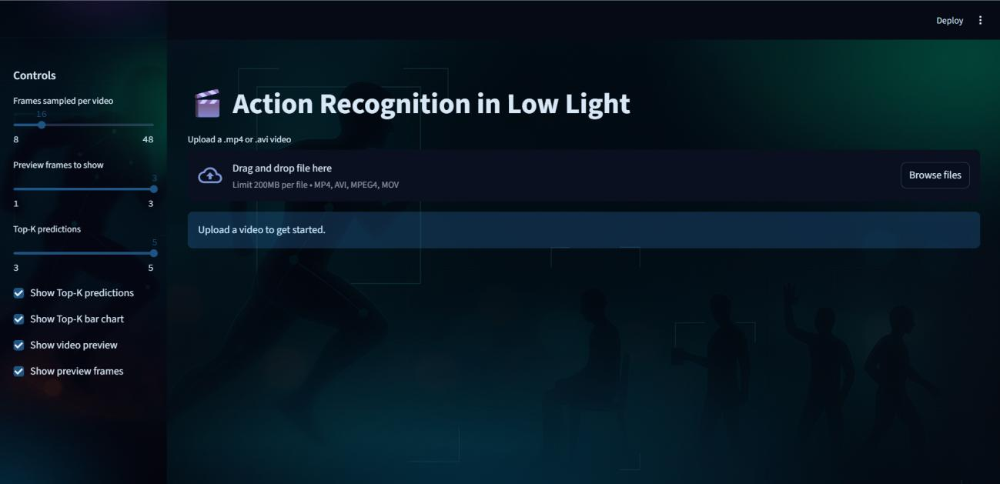
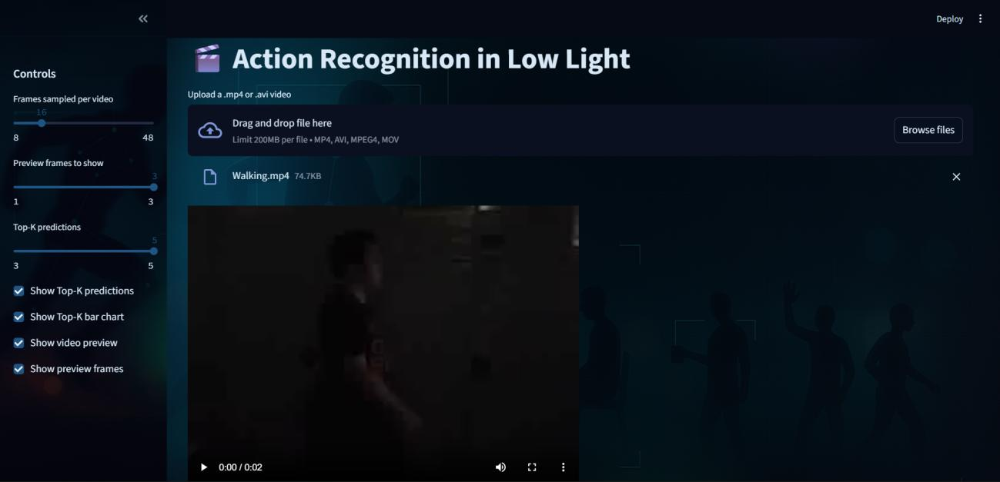
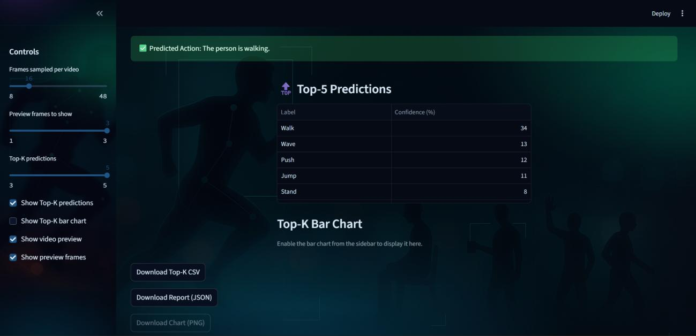
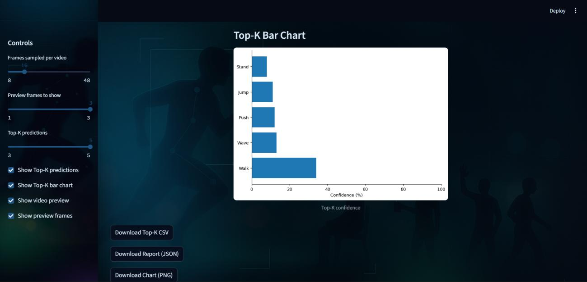
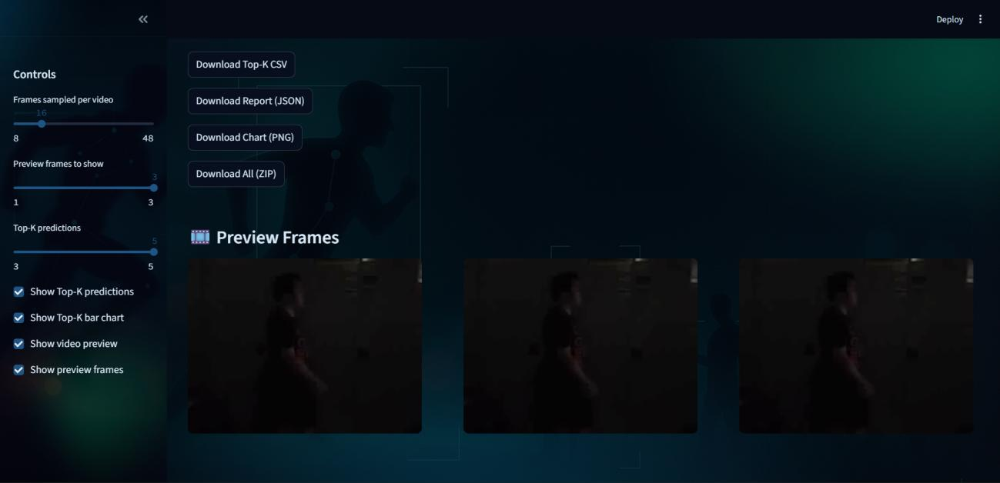
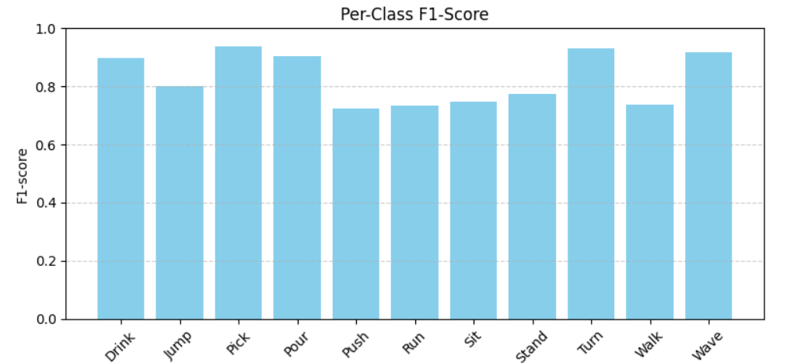
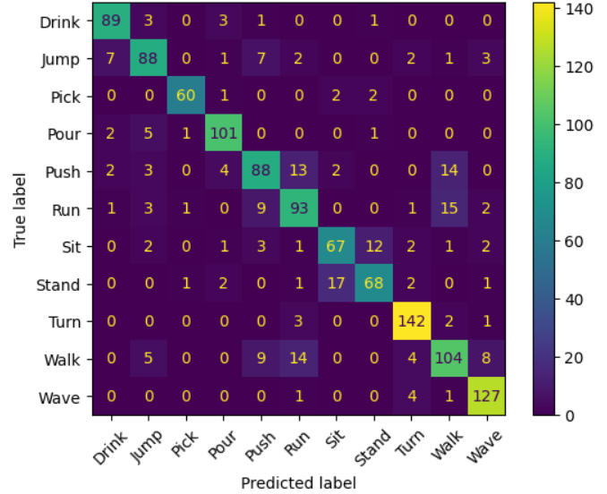
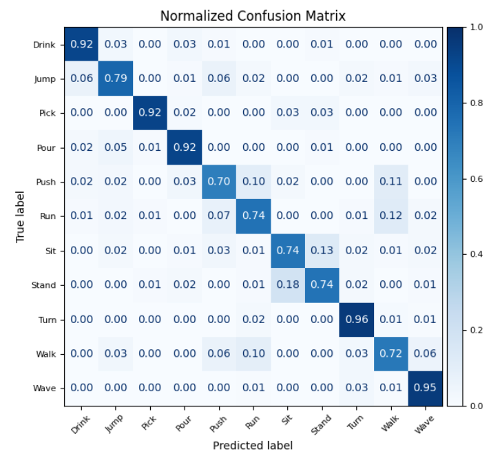
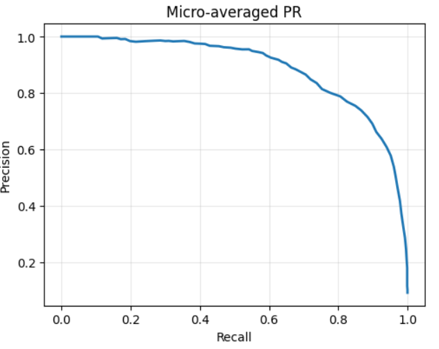
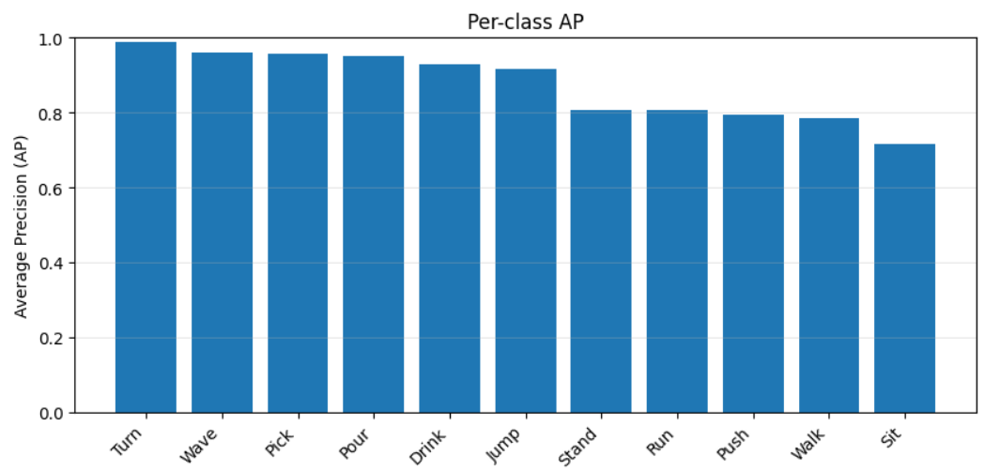

# Action Recognition in Low-Light Videos


---

A computer vision and machine learning system for recognizing human actions in **dark and low-light videos** using **ResNet50 feature extraction**, **mean pooling**, and a **Random Forest classifier**, with an interactive **Streamlit web application** for video-based inference.

## Overview

Low-light video introduces challenges such as reduced contrast, sensor noise, and motion blur, making conventional action-recognition systems less reliable.

This Senior Design Project explores a lightweight approach to recognizing human actions under these difficult conditions using the **ARID v1.5 low-light action recognition dataset**.

Instead of training a computationally expensive end-to-end video model, the system uses an ImageNet-pretrained **ResNet50** as a frame-level feature extractor. The extracted features are aggregated into a clip-level representation using mean pooling and classified using a **Random Forest**.

A Streamlit application provides an interactive interface where users can upload a low-light video and receive ranked action predictions with confidence scores.


## Preview

<table align="center">
  <tr>
    <td align="center">
      <br>
      <sub><b>Streamlit Application Home Screen</b></sub>
    </td>
    <td width="20"></td>
    <td align="center">
      <br>
      <sub><b>Uploaded Low-Light Video Preview</b></sub>
    </td>
  </tr>
</table>

---

## Streamlit Application

The project includes an interactive Streamlit application for testing the trained action-recognition model.

### Supported Video Formats

* MP4
* AVI
* MPEG4
* MOV

### User Controls

The interface allows users to configure:

* number of frames analyzed
* number of preview frames displayed
* Top-K prediction count
* prediction table visibility
* confidence chart visibility
* video preview
* frame preview

### Prediction Interface

<table align="center">
  <tr>
    <td align="center">
      <br>
      <sub><b>Top-5 Action Predictions with Confidence Scores</b></sub>
    </td>
    <td width="20"></td>
    <td align="center">
      <br>
      <sub><b>Top-K Prediction Confidence Chart</b></sub>
    </td>
  </tr>
</table>

### Frame Preview and Downloads

<p align="center">
  <br>
  <sub><b>Sampled Frame Preview and Result Export Options</b></sub>
</p>

### Export Options

Prediction results can be downloaded as:

* Top-K predictions — CSV
* prediction report — JSON
* confidence chart — PNG
* complete results package — ZIP

---

## Reported Results

The final model was evaluated on a held-out test set.

| Metric                |     Result |
| --------------------- | ---------: |
| **Top-1 Accuracy**    |  **82.7%** |
| **Top-5 Accuracy**    |  **98.9%** |
| **Macro Precision**   | **≈ 0.83** |
| **Macro Recall**      | **≈ 0.83** |
| **Macro F1-Score**    | **≈ 0.83** |
| **Micro-Averaged AP** |  **0.883** |

The results show that the model achieves approximately **83% Top-1 accuracy**, while the correct action appears within the model's Top-5 predictions approximately **99% of the time**.

## Per-Class Performance

Some of the strongest-performing action classes were:

| Action | F1-Score |
| ------ | -------: |
| Pick   |     0.94 |
| Turn   |     0.93 |
| Wave   |     0.92 |
| Pour   |     0.91 |
| Drink  |     0.90 |

More challenging classes included visually similar movements such as **Push**, **Walk**, and **Run**, particularly under poor illumination.

<p align="center">
  <br>
  <sub><b>Per-Class F1-Score</b></sub>
</p>

## Confusion Analysis

The confusion matrices show that most predictions fall along the diagonal, indicating strong classification performance across the action classes. The normalized matrix makes the per-class recognition rates easier to compare and highlights the more challenging action pairs.

<table align="center">
  <tr>
    <td align="center">
      <br>
      <sub><b>Confusion Matrix</b></sub>
    </td>
    <td width="20"></td>
    <td align="center">
      <br>
      <sub><b>Normalized Confusion Matrix</b></sub>
    </td>
  </tr>
</table>

## Ranking Quality

Because the Random Forest produces class probability scores, the system was also evaluated using Precision–Recall analysis and Average Precision.

The **micro-averaged Average Precision of 0.883** indicates strong overall ranking quality, meaning the correct action is generally ranked highly among the model's predictions.

<table align="center">
  <tr>
    <td align="center">
      <br>
      <sub><b>Micro-Averaged Precision–Recall Curve</b></sub>
    </td>
    <td width="20"></td>
    <td align="center">
      <br>
      <sub><b>Per-Class Average Precision</b></sub>
    </td>
  </tr>
</table>


## Key Features

- Human action recognition specifically designed for **low-light video**
- ImageNet-pretrained **ResNet50** for transfer-learning-based feature extraction
- **2048-dimensional feature representation** extracted from each processed frame
- Mean pooling to create a fixed-length video representation
- **Random Forest** multi-class classifier
- Top-1 and Top-K action predictions
- Confidence scores for predicted actions
- Interactive **Streamlit web application**
- Video preview before prediction
- User-selectable number of frames for inference
- Preview of frames analyzed by the model
- Top-K confidence visualization
- Downloadable prediction results in:
  - CSV
  - JSON
  - PNG chart
  - ZIP package

## Recognized Actions

The trained model recognizes the following 11 action classes:

- Drink
- Jump
- Pick
- Pour
- Push
- Run
- Sit
- Stand
- Turn
- Walk
- Wave

## Tech Stack

### Programming / Computer Vision


### Deep Learning / Machine Learning


### Application / Visualization


## Model Architecture

```text
Low-Light Video
      ↓
Frame Sampling & Preprocessing
      ↓
Resize to 224 × 224
      ↓
RGB Conversion + ImageNet Normalization
      ↓
Pretrained ResNet50
(Classification Layer Removed)
      ↓
2048-D Feature Vector / Frame
      ↓
Mean Pooling Across Frames
      ↓
2048-D Clip Representation
      ↓
Random Forest Classifier
      ↓
Top-1 / Top-5 Action Predictions
      ↓
Streamlit Interface
```

## How the Model Works

### 1. Video Processing

Frames are sampled from the input video and prepared for the ResNet50 feature extractor.

Each selected frame is:

- converted from BGR to RGB
- resized to **224 × 224**
- converted into a tensor
- normalized using ImageNet statistics

### 2. ResNet50 Feature Extraction

A pretrained **ResNet50** model is used with its final classification layer removed.

Instead of producing an ImageNet class prediction, ResNet50 generates a:

**2048-dimensional feature vector**

for each processed frame.

### 3. Clip-Level Representation

The feature vectors extracted from the video frames are combined using **mean pooling**.

```text
Frame 1 ──→ 2048-D ┐
Frame 2 ──→ 2048-D │
Frame 3 ──→ 2048-D ├──→ Mean Pooling ──→ 2048-D Video Vector
...                 │
Frame N ──→ 2048-D ┘
```

This produces one compact representation for the entire video.

### 4. Random Forest Classification

The final 2048-dimensional video vector is passed to the trained **Random Forest classifier**.

The classifier generates probabilities for each action class and returns the highest-ranked predictions.

### 5. Prediction Interface

The Streamlit application displays:

- Top-1 predicted action
- Top-K predictions
- confidence percentages
- confidence bar chart
- uploaded video preview
- sampled frame previews

Users can also download prediction results for further analysis.

## Reported Results

The final model was evaluated on a held-out test set.

| Metric | Result |
| --- | ---: |
| **Top-1 Accuracy** | **82.7%** |
| **Top-5 Accuracy** | **98.9%** |
| **Macro Precision** | **≈ 0.83** |
| **Macro Recall** | **≈ 0.83** |
| **Macro F1-Score** | **≈ 0.83** |
| **Micro-Averaged AP** | **0.883** |

The results show that the model achieves approximately **83% Top-1 accuracy**, while the correct action appears within the model's Top-5 predictions approximately **99% of the time**.

## Per-Class Performance

Some of the strongest-performing action classes were:

| Action | F1-Score |
| --- | ---: |
| Pick | 0.94 |
| Turn | 0.93 |
| Wave | 0.92 |
| Pour | 0.91 |
| Drink | 0.90 |

More challenging classes included visually similar movements such as **Push**, **Walk**, and **Run**, particularly under poor illumination.

## Streamlit Application

The project includes an interactive Streamlit application for testing the trained model.

### Supported Video Formats

- MP4
- AVI
- MPEG4
- MOV

### User Controls

The interface allows users to configure:

- number of frames analyzed
- number of preview frames displayed
- Top-K prediction count
- prediction table visibility
- confidence chart visibility
- video preview
- frame preview

### Export Options

Prediction results can be downloaded as:

- Top-K predictions — CSV
- prediction report — JSON
- confidence chart — PNG
- complete results package — ZIP

## Dataset

The research and model development were based on **ARID v1.5**, a dataset designed specifically for human action recognition in dark environments.

The dataset itself is **not included in this repository**.

For the research experiments, the dataset was divided at the video level into:

- **70% Training**
- **15% Validation**
- **15% Testing**

This prevents video leakage between training and evaluation sets.

## Project Structure

```text
CSE-499-Capstone-Action-Recognition-in-Low-Light-/
├── .streamlit/
├── assets/
├── app.py
├── label_to_idx.pkl
└── rf_model.pkl
```

## File Details

- `app.py` — Streamlit application, video processing, ResNet50 feature extraction, prediction, visualization, and export logic
- `rf_model.pkl` — trained Random Forest classifier
- `label_to_idx.pkl` — mapping between action labels and model class indices
- `assets/` — visual assets used by the Streamlit interface
- `.streamlit/` — Streamlit application configuration

## How to Run

### Requirements

- Python 3.x
- PyTorch
- torchvision
- Streamlit
- scikit-learn
- OpenCV
- NumPy
- Pandas
- Pillow
- Matplotlib
- Joblib

### Clone the Repository

```bash
git clone https://github.com/HR-Naayeem/CSE-499-Capstone-Action-Recognition-in-Low-Light-.git
cd CSE-499-Capstone-Action-Recognition-in-Low-Light-
```

### Install Dependencies

```bash
pip install streamlit torch torchvision scikit-learn opencv-python numpy pandas pillow matplotlib joblib
```

### Run the Application

```bash
streamlit run app.py
```

The application will open in your browser using the local Streamlit server.

## Practical Applications

This project demonstrates how lightweight action recognition can support video analytics in poorly illuminated environments, including:

- CCTV monitoring
- night-time security systems
- parking areas
- campuses
- residential complexes
- indoor surveillance
- safety and incident-review workflows

The system is intended as a **decision-support tool**, where predictions help human operators identify potentially relevant activity rather than replacing human judgment.

## Challenges Addressed

- Reduced contrast in dark video
- Sensor noise and motion blur
- Feature extraction under poor illumination
- Efficient video-level representation
- Multi-class action classification
- Balancing accuracy with computational cost
- Presenting machine-learning predictions through an accessible interface

## Future Improvements

- Add lightweight temporal modeling to capture relationships between consecutive frames
- Apply conservative low-light enhancement before feature extraction
- Improve performance on visually similar action classes
- Calibrate prediction confidence scores
- Explore domain adaptation using additional low-light CCTV footage
- Test lighter backbones such as MobileNetV3 and EfficientNet
- Add model monitoring and active-learning workflows
- Extend the system to multi-camera environments
- Explore ONNX and optimized edge-device deployment

## Repository Scope

This repository contains the **trained model artifacts and Streamlit inference application** used to demonstrate the project.

The complete research methodology included:

- ARID v1.5 dataset preparation
- frame sampling and preprocessing
- ResNet50 feature extraction
- mean pooling
- Random Forest training
- model evaluation
- confusion matrix analysis
- precision-recall analysis
- Streamlit deployment

## Project Team

**Senior Design Project — North South University**

- MD Hasibur Rahman
- Sanjida Akhter Sadia
- Jannatul Ferdous Mim
- Humayara Mahajabin
- Sadiea Islam Sinthia

**Faculty Advisor:** Intisar Tahmid Naheen  
Senior Lecturer  
Department of Electrical and Computer Engineering  
North South University

## Repository Owner

**MD Hasibur Rahman**  
North South University
